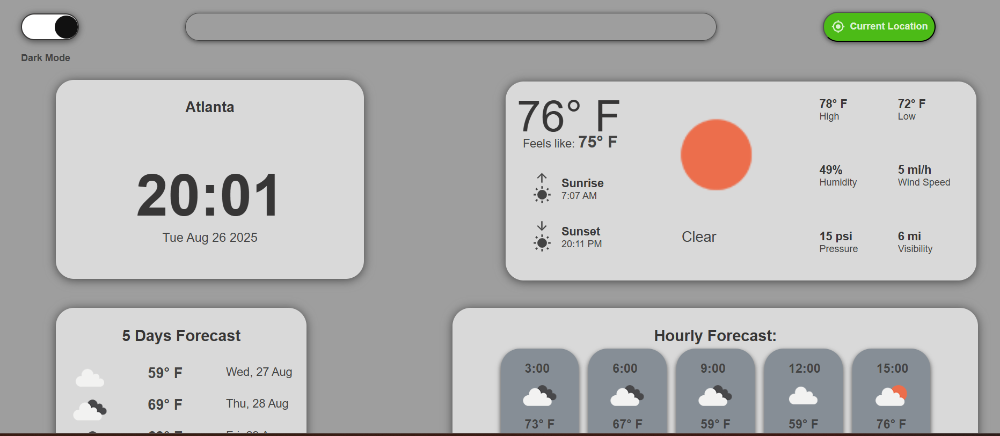

# 🌦️ Weather App – React Project

This is a simple and interactive **Weather App** built with React. It allows users to search for a city and view real-time weather information such as temperature, conditions, and icons fetched from a weather API. The project demonstrates API integration, dynamic rendering, and clean UI design.

## 🚀 Live Demo

🔗 [View Weather App](https://maddiepst.github.io/weather-a-/)

## 📸 Screenshot

## 📚 Features

- 🌍 Search weather by city name  
- 🌡️ Display current temperature and weather conditions  
- 🖼️ Dynamic weather icons based on API response  
- ⚡ Real-time API integration with user input  
- 🎨 Responsive and clean user interface  

## 🧠 What I Learned

This project helped me strengthen the following skills:

1. **API Integration** – Fetching live weather data using `fetch()` in React.  
2. **State Management** – Using `useState` and `useEffect` to handle API data and user input.  
3. **Conditional Rendering** – Displaying loading/error messages and weather details dynamically.  
4. **Controlled Components** – Managing search input fields with React state.  
5. **Dynamic Styling** – Updating UI visuals based on weather conditions.  

## 🛠️ Built With

- React (Hooks: `useState`, `useEffect`)  
- JavaScript (ES6+)  
- CSS3 (responsive design)  
- OpenWeather API (or chosen weather API)  
- GitHub Pages (deployment)  
